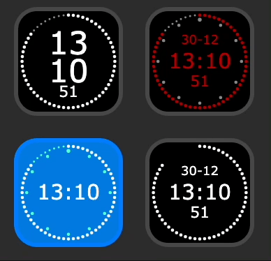
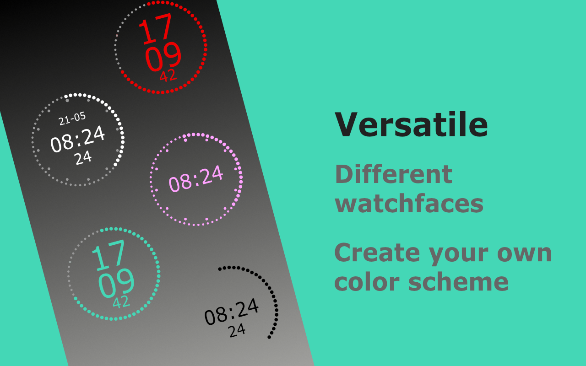
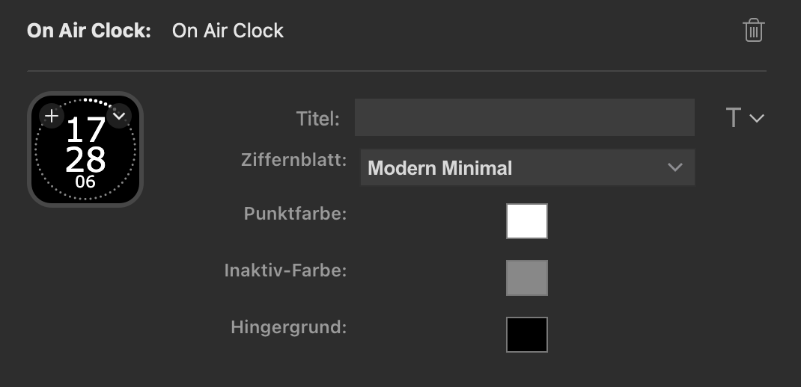

# streamdeck-onairclock

A versatile and configurable broadcast-inspired on air clock for Elgato Stream Deck.



## Features



* Choose between different watchfaces - including classic on air clock or more modern clockface
* Change the appearance colors by simply setting color values. 
* Set the watch to display date (dd-mm) and/or seconds or just hh:mm.



## Installation

### Package file

Download the fail.marc.onairclock.streamDeckPlugin file from releases section and install it directly with streamdeck software.

### From elgato plugin store

The plugin is not submitted yet. Will do this once all features are included and tested enough.

### Manually using sources from github

#### Mac

Go to 

    '~/Library/Application Support/com.elgato.StreamDeck/Plugins/'

and copy the fail.marc.onairclock.sdPlugin folder there.

Then relaunch streamdeck software.

#### Windows 

Go to

    '%appdata%\Elgato\StreamDeck\Plugins'

and copy the fail.marc.onairclock.sdPlugin folder there.

Then relaunch streamdeck software.

## Developing

Follow [this tutorial](https://developer.elgato.com/documentation/stream-deck/sdk/create-your-own-plugin/) for advice on how to debug the plugin.

## Distribution

Not yet done. Should work using DistributionTool and this command:

```sh
./DistributionTool -b -i fail.marc.onairclock.sdPlugin/ -o release/
```

Make sure to rm or rename file from release folder before calling DistributionTool.

## Dependencies

Currently just the official [Stream Deck SDK](https://developer.elgato.com/documentation/stream-deck/sdk/overview/).

## Disclaimer

I made this plugin just for fun and because I thought it would be handy to have a plugin like that. Therefore, it is released under MIT license. Do whatever you want with it, but it comes without warranty or liability of any kind.

However, an acknowledgement would be nice.

## Acknowledgements

This plugin is based on the [elgato plugin template](https://github.com/elgatosf/streamdeck-plugintemplate).
The clock calculation and drawing routine is inspired by [this kirupa tutorial](https://www.kirupa.com/html5/create_an_analog_clock_using_the_canvas.htm).
